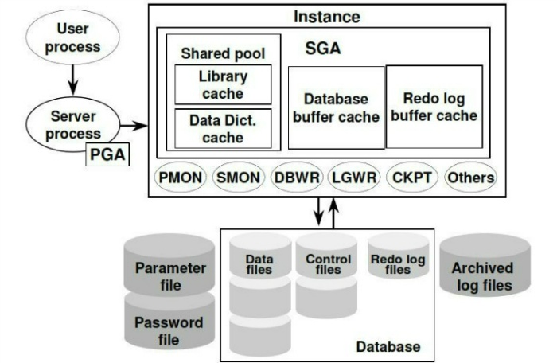

# 목차
 1. [SQL Tunning이란?](#sql-tunning이란)
 2. [DB의 접속 과정](#db의-접속-과정)
 3. [Oracle의 기본 보안정책](#oracle의-기본-보안정책)
 4. [SELECT 쿼리 처리 과정](#select-쿼리-처리-과정)
 5. [Oracle 메모리 구조](#oracle-메모리-구조)
 6. [Oracle의 3대 필수 파일](#oracle의-3대-필수-파일)
 7. [Storage](#storage)
 8. [Optimizer 이해](#optimizer-이해)
 9. [실행계획](#실행계획)
 10. [Index 기본](#index-기본)
 11. [Table Scan 종류](#table-scan-종류)
 12. [Index Scan 종류](#index-scan-종류)
 13. [Clustering Factor](#clustering-factor)
 14. [소량의 데이터 검색에서 Index Scan으로 필요한 범위만 Access 하지 못하는 경우에 이유와 해결 방법](#소량의-데이터-검색에서-index-scan으로-필요한-범위만-access-하지-못하는-경우에-이유와-해결-방법)
 15. [Index 관련 튜닝 사례](#index-관련-튜닝-사례)
 90. [비고 - Redo Log 관리 이유](#비고---redo-log-관리-이유)
 90. [비고 - Soft Parsing VS Hard Parsing 비교](#비고---soft-parsing-vs-hard-parsing-비교)
 90. [비고 - Optimizer 동작 방식에 따른 실행계획 확인해보기](#비고---optimizer-동작-방식에-따른-실행계획-확인해보기)
 90. [비고 - 분석 함수 관련](#비고---분석-함수-관련)
 90. [비고 - Index 사용](#비고---index-사용)
 90. [비고 - Index 생성 관련(B-Tree Index 기준)](#비고---index-생성-관련b-tree-index-기준)
 90. [비고 - Full Table Scan VS Index Scan](#비고---full-table-scan-vs-index-scan)
 90. [비고 - Index 단점](#비고---index-단점)
 90. [비고 - Hint가 동작하지 못하는 경우](#비고---hint가-동작하지-못하는-경우)
 90. [비고 - 컬럼 분포도에 따른 히스토그램 통계 정보 수집 차이](#비고---컬럼-분포도에-따른-히스토그램-통계-정보-수집-차이)
 90. [비고 - 복합 Index 구성 관련](#비고---복합-index-구성-관련)
 90. [비고 - 튜닝 사례들로부터 Index와 관련된 SQL 문제 유형 분류](#비고---튜닝-사례들로부터-index와-관련된-sql-문제-유형-분류)


## SQL Tunning이란?
 - Resource 사용량을 줄이는 과정이다.
 - Resource 사용량을 줄인 만큼 더 많은 일을 시키는 과정이다.
 - 주 목적은 아래와 같이 나뉜다.
    - 1순위) I/O 사용량 줄이기
        - 1-1순위) Physical I/O 줄이기 (=DISK I/O)
        - 1-2순위) Logical I/O 줄이기 (=Memory I/O)
    - 2순위) Memory 사용량 줄이기
 - 위와 같이 SQL 쿼리에 대해서 튜닝하는 것은 일반적인 사용자들의 영역이나, 다른 영역의 튜닝도 있다.
    - Server Tunning에 대해서 말하는 것이며, 이는 DBA의 영역이다.
        - 주로 SQL 쿼리가 아닌, Process 사용량 튜닝 등의 과정을 진행한다.


## DB의 접속 과정
 - 기본적으로 Oracle은 Listener를 통해 모든 Connection을 관리한다.
 - DB 연결 시, 동작 모드는 아래와 같이 2가지로 나뉜다.
    - Dedicated Mode
        - OLAP 방식이라고도 한다.
        - 주로 정보계 DB로 활용한다.
        - SQL 쿼리의 한개 크기가 크거나, 트랜잭션이 오랜시간(1시간 이상 등) 유지되는 환경에서 사용한다.
            - 추가적으로 병렬 쿼리 실행 등의 환경에서도 쓰인다.
        - User Processor와 Server Processor가 1:1로 구성 및 연결 된다.  
        
        
    - Shared Mode
        - OLTP 방식이라고도 한다.
        - 주로 운영계 DB로 활용한다.
        - SQL 쿼리의 한개 크기가 작거나, 트랜잭션이 빠르게 끝나는 환경에서 사용한다.
        - User Processor와 Server Processor가 N:M으로 구성 및 연결 된다.
        - User Processor ↔ Server Processor 간의 통신 시에는 중간에서 Dispatcher가 데이터를 관리한다.
            - Dispatcher는 Request Queue와 Response Queue를 가지고 있다.
            - 요청 데이터는 보관하였다가 Server Processor에 반환을 하고, 응답 데이터는 보관하였다가 User Processor에게 반환해준다.  
        
        


## Oracle의 기본 보안정책
 1. 인증
    - User/PW를 통해 사용자 인증을 수행한다.
 2. 권한
    - 권한 SQL 수행에 대해 제어를 한다.
 3. 암호화
    - 민감한 컬럼은 암호화 하여 데이터를 평문으로 볼 수 없도록 한다.
 4. 감사
    - SQL 실행 이력을 보관한다.
 5. 등등등


## SELECT 쿼리 처리 과정
 1. Syntax Check
    - 문법 검사를 수행.
 2. Semantic Check
    - Medata Data의 정보를 읽어 해당 정보를 토대로 권한 검사를 수행한다.
    - Shared Pool의 Dictionary Cache에서 정보를 찾으며, 못찾으면 DB Buffer Cache에서 정보를 찾는다. (Logical I/O)
        - 만일 DB Buffer Cache에서도 못찾으면 Data File에서 찾는다. (Physical I/O)
 3. 실행계획 Check
    - SQL 명령에 대해 HASH 함수를 통해 HASH 값을 만들어 낸다.
    - 해당 HASH 값을 통해 Library Cache 에서 SQL Context를 찾는다.
        - SQL Context가 있으면 Explain Plan(실행계획)을 사용해서 실행한다.
        - 여기서 이미 작성되어 있는 SQL Context를 찾으면 실행계획 신규 작성 없이 바로 해당 계획 토대로 SQL 명령을 실행한다.
            - 이러한 과정을 Soft Parsing 이라고 한다.
        - 만일 위 과정에서 SQL Context를 찾지 못하면 Optimizer를 통해 새로운 실행계획을 생성하여, 해당 계획 토대로 SQL 명령을 실행한다.
            - 이러한 과정을 Hard Parsing 이라고 한다.
        - 참고로 OLAP 환경에서는 다양한 쿼리를 수행해야하기 떄문에 Soft/Hard Parsing이 중요성이 비교적 떨어진다.
            - 다양한 데이터를 불러오는 것이 주 목적이기 때문에 중요성이 비교적 떨어진다.
            - OLAP 환경에서는 성능 최적화 보다는 주로 분산/병렬 쿼리를 사용함.
 4. Execute
    - 먼저 바인드 변수인 경우에는 ? 부분에 실제 값을 맵핑 해준다.
        - 바인드 쿼리는 Execute 단계에서 조건절의 값 맵핑을 진행하기 때문에 만들어진 실행계획을 재사용하는 soft parsing이 가능하다.
    - 불러올 데이터를 DB Buffer Cache에서 탐색을 한다.
        - DB Buffer Cache에 없으면 Data File에서 block 단위로 데이터를 DB Buffer Cache에 불러온다. (Memory I/O → DISK I/O)
        - 만일 DB Buffer Cache에 저장할 공간이 없으면, 오래된 block을 삭제한다.
 5. Fetch
    - 위 단계에서 불러온 데이터를 사용자에게 제공해준다.
        - 단, array size 구성에 따라 한번에 모든 데이터가 Fetch 되지 않는 경우, 여러번 Fetch 될 수 있다.


## Oracle 메모리 구조
 - Oracle에서는 메모리 구조가 2가지 영역으로 나뉜다.
 - PGA
    - Private Global Area 혹은 Program Global Area 이다.
    - 각각의 Server Processor가 단독으로 사용하는 영역이다.
    - 아래와 같이 구성이 되어 있다.
        - private SQL Area
            - 튜닝 불가능한 영역이다.
            - DB 성능에 영향을 주지 않는다. 
        - Session 정보
            - 튜닝 불가능한 영역이다.
            - DB 성능에 영향을 주지 않는다.
        - Cursor 상태
            - 튜닝 불가능한 영역이다.
            - DB 성능에 영향을 주지 않는다.
        - SQL Work Area
            - 튜닝 가능한 영역이다.
            - 정렬(Sort), 해시 조인, 집계 등의 작업을 진행한다.
 - SGA
    - System Global Area 이다.
    - Background Processes와 Server Processes들이 공유하는 메모리이다.
    - 여러 User Processor가 공용으로 사용하는 영역이다.
    - Shared Pool과 DB Buffer Cache는 I/O와 관련되어 있으며, 그만큼 Oracle의 성능과 밀접한 관계가 있다.
    - 아래와 같이 구성이 되어 있다.
    
        - Shared Pool
            - 주로 SQL 구문 분석(Parsing)에 활용되는 공간이다.
                - 하여 Oracle의 성능에 중요한 역할을 한다.
            - 내부적으로 3가지 영역으로 나뉜다.
                - Library Cache
                    - SQL 구문의 Parsing 정보를 보관한다.
                        - 보관된 Parsing 정보를 활용하여 SQL 구문을 실행하는 경우, Soft Parsing이 이뤄진다.
                        - Parsing 정보가 보관된게 없어 새로 Parsing을 수행해야하는 경우에는 Hard Parsing을 진행하게 된다.
                    - SQL의 정보를 기록하는 영역을 SQL Area 라고도 한다.
                        - SQL Area에는 SQL Context가 있고, SQL 구문은 HASH 값을 통해 SQL Context를 찾는다.
                        - SQL 정보들은 SQL Context 라는 형태로 SQL Area에 저장된다.
                - Data Dictionary Cache
                    - 테이블, 컬럼, 유저, 권한 등 Oracle 데이터베이스의 Meta Data를 저장합니다.
                        - 해당 Meta Data를 통해 사용자의 권한을 검사한다.
                        - 만일 해당 영역에서 Meta Data를 찾지 못하면, DB Buffer Cache에서 데이터를 찾는다.
                            - DB Buffer Cache에서도 못찾으면 DISK에서 찾는다.
                    - USER_ / ALL_ / DBA_ / V$ 로 시작하는 테이블들이 해당된다.
                - Result Cache
                    - SQL 쿼리 결과를 자체적으로 저장한다.
                    - 동일한 쿼리 반복 실행 시, Parsing 과정 없이 바로 결과를 반환해준다.
                        - 하여, Soft Parsing 보다 더 좋은 성능이 나온다.
            - Shared Pool의 영역은 크기가 커지면 자동으로 줄어드나, 크기가 너무 작아져도 성능에 문제가 있다는 특성이 있다.
                - 크기가 작아지면 SQL Parsing 정보 보관이 어려워, Soft Parsing이 그만큼 어려워지게 된다.
            - 기본적으로 Shared Pool에서 찾고자 하는 데이터를 못찾는 경우에는 DB Buffer Cache에서 찾게된다. 그러나 DB Buffer Cache에서도 못찾게되면 DISK에서 데이터를 찾게된다.
                - Shared Pool이나 DB Buffer Cache까지는 Logical I/O이기 때문에 어느정도 성능상 문제는 없으나, DISK까지 가게되면 Physical I/O가 발생하게된다.
                - 이는 성능상 문제가 될 수 있어 튜닝 과정을 고려해보는것이 좋다.
        - DataBase Buffer Cache
            - DISK에서 읽어온 Data File을 Block 단위로 내용을 보관하는 공간이다.
            - DB에서 데이터를 가져올때는 DISK에 접근하기 전에 DB Buffer Cache에 먼저 찾는다.
                - DISK에 접근하면 Physical I/O가 발생하나, DB Buffer Cache에서 데이터를 먼저 찾게 되면 Logical I/O 만으로 끝낼 수 있게 된다.
            - 데이터를 관리하는 최소 Block 단위를 관리한다.
                - 기준을 일반적으로는 OLTP는 작게 잡고(최소 2K), OLAP는 크게 잡는다.(최대 32K)
                    - 기본값은 위 작고/크고의 중간 값인 8K이다.
            - DB Buffer Cache 내에도 영역이 여러개로 나뉜다.
                - Free Space Buffer
                    - 아직 사용되지 않은 Block의 영역이다.
                - Pinned Buffer Buffer
                    - 현재 사용 중인 Block의 영역이다. (제거 불가)
                - Dirty Buffer
                    - 데이터 변경이 이뤄졌으나, DISK에 기록되지 않은 데이터의 영역이다.
                - Clean BUffer
                    - 데이터가 변경이 이뤄지지 않고, 필요 시 바로 제거가 가능한 영역이다.
                - CR(Consistent Read) Buffer
                    - 읽기 일관성을 위한 과거 시점의 데이터 Block 복사본 Buffer이다.
                    - userA가 원본 데이터 변경중으로 Lock이 잡힌 경우, userB가 해당 데이터에 접근하려고 할 때, Undo에서 데이터를 꺼내와서 CR Buffer에 기록하고, 그 데이터를 제공해주는 용도로 쓰인다.
        - Redo Log Buffer Cache
            - DB에서 발생한 변경 이력들은 Redo Log File에 저장되는데, 해당 File에 아직 저장되지 않은 데이터들은 Redo Log Buffer Cache에 저장된다.
        - Java Pool
            - Java를 통해 Oracle의 데이터를 사용하고자 할 때, JDK가 사용하는 여러 Java Class를 보관하는 영역이다.
            - 기본적으로 자동으로 관리되며, 크게 관여할 영역이 아니다.
        - Large Pool
            - PGA 또는 Shared Pool의 부담을 줄이기 위한, 대용량 작업을 위한 별도 메모리 풀이다.
            - 주로 백업/복구, 병렬 처리, 세션 메모리 등에 사용한다.
        - 다수의 BGP (BackGround Processor)
            - 무수히 많은 종류가 있으나, 대표적으로 아래와 같은 대상들이 있다.
            - PMON (Process Monitor)
                - 비정상 종료된 세션이나 프로세스의 정리를 한다.
                - 트랜잭션 발생 시, 객체에 Lock을 잡고, 비정상 객체 Lock 해제도 관리해준다.
                    - 객체 Lock이 잡힌 상태로 트랜잭션이 비정상 종료되면, 다음 데이터들이 계속 대기 상태가 된다.
                    - 데이터들이 계속 대기 상태가 되면, DB가 비정상 종료될 수 있다.
            - SMON (System Monitor)
                - 시스템 전체 상태를 유지 및 복구 관리한다.
                - Data File과 Control File을 비교하여 Instance Crash에 대해 Instance recovery를 수행.
            - DBWR (Database Writer)
                - DB Buffer Cache의 Dirty Buffer내의 데이터들을 Data File에 기록한다.
                - 데이터 기록은 Check Point를 기준으로 수행한다.
                    - 데이터를 받을 때마다 기록하게되면 쓰기 완료까지 기다려야하기 떄문에 전체적으로 느려진다.
                    - 하여, Check Point를 기준으로 하며, 변경된 정보를 모았다가 한번에 쓰기 수행한다.
            - LGWR
                - Redo Log Buffer에 기록된 변경 내용을 Redo Log File로 디스크에 기록하는 역할을 한다.
                - 기록하는 Redo Log File의 용량이 꽉차면 다음 File에 데이터를 기록한다.
                    - 만일 할당된 모든 Redo Log File이 꽉차면 다시 처음 파일에 데이터를 덮어씌운다.
            - CKPT
                - Check Point가 생기면 관련 Meta Data를 DISK에 기록하는 역할을 한다.
            - Archiver
                - Redo Log File이 가득 차서 로그 스위치가 발생했을 때, 해당 로그를 복사하여 아카이브 로그 파일로 저장하는 백그라운드 프로세스
                    - 즉, 덮어씌워질 Redo Log를 한번더 백업하는 역할을 한다.


## Oracle의 3대 필수 파일
 - Data File
    - Tablespace의 물리적 저장소 
        - Table Data, Index Data 저장
 - Control File
    - 데이터베이스의 Meta 정보를 보관한다.
        - check point 정보
        - DB 생성 날짜시간
        - DB 이름
        - Tablespace 목록
        - datafile 경로이름
        - redolog file 경로이름
        - archive log mode 여부
        - flashback log 활성화
        - RMAN의 Backup&Recovery Meta 정보(시간이 지남에 따라 Override 됨.)
 - Redo Log File
    - 데이터 변경 이력을 저장한다.
    - 여러개의 파일이 순환방식으로 관리된다.
        - 용량이 꽉차면 다음 파일, 모든 파일이 꽉차면 처음 파일을 덮어씌우기...
    

## Storage
 - 논리적
    - 기존 Oracle DB는 Instance와 DB가 1:1 이였다.
    - 12c부터 클라우드로 방향성을 나아가게 되어 Instance와 Container가 1:1로 구성되고, Container와 DB가 1:N 으로 구성할 수 있게 기능이 생겼다.
    - 논리적 저장소는 아래와 같이 있다.
        - 크기 순으로는 Data File > Tablespace > Segment > Extent > Oracle Block 순이다.
            - Data File에는 한개 혹은 여러개의 Tablespace가 구성될 수 있음.
        - Tablsespace
            - 아래와 같이 여러개의 영역으로 데이터가 저장되어 Data Type Container라고 함.
            - 필수 영역
                - SYSTEM
                    - Data Dictionary 정보를 저장
                - SYSAUX
                - TEMP
                    - 임시 데이터를 저장.
                - UNDO
                    - MVCC 라는 개념이 있다.
                        - 여러 버전의 데이터를 동시성/일관성을 관리한다.
                        - Oracle은 LOCK과 UNDO를 통해 동시성을 관리한다.
                    - Oracle은 변경 전 데이터를 UNDO에 저장하고, 데이터를 복원하면 해당 영역에서 저장된 데이터를 활용.
        - Segment
            - 객체(table, view, index 등등)들의 데이터 저장단위.
            - Tablespace 내에는 여러개의 연속된 Segment 가 저장됨.
            - 1개의 Segment는 1개의 Tablespace에 종속되어야하지만, 파티션 테이블인 경우에는 한개의 테이블에서 각 파티션별로 Segment가 따로 구성되기 떄문에 각 파티션별로 다른 Tablespace에 종속될 수 있다.
        - Extent
            - 할당 단위
            - Extent 내에는 연속된 Oracle Block이 저장.
        - Oracle Block
            - I/O 단위
            - DB_BLOCK_SIZE 설정에 해당됨.
    - ASM
        - DISK 관리 관련해서는 ASM이란게 있다.
        - Oracle은 원래 RAID 시스템 구축 시, 외부 업체에서 구매해서 사용했었으나, 비용적 문제로 자체적으로 RAID를 구성하였다.
        - 즉, 자체적으로 RAID 시스템을 구성한 것을 ASM 이라고 한다.
 - 물리적
    - DISK 기반으로 영역을 나누어 DISK 단위로 관리.
    - OS File System을 통해 File 단위로 관리하기도 함.


## Optimizer 이해
 - Optimizer는 SQL문을 최적화하는 DBMS의 핵심엔진이다.
 - Optimizer는 SQL 성능을 최적화하는 것을 목표로 SQL 명령문에 대해 가장 빠른 실행 방법을 자동으로 선택하려고 한다.
 - 기본적으로는 Full Table Scan을 할건지? Index Scan을 할건지? 결정한다.
    - 대량의 데이터는 Full Table Sacn이 유리하고, 소량의 데이터는 Index Scan이 유리하다.
        - 반대로 Full Table Scan은 소량 데이터에 불리하고, Index Scan은 대량 데이터에 불리하다.
        - 대량/소량의 기준은 전체 데이터 수량에 따라 비율이 달라지게 된다.
    - 위 기본적인 결정 사항에서 상세 탐색 방안을 정한다.
        - Index Range Scan 등등
        - Join의 경우 Nested Loop Join? Hash Join? 등등
 - Optimizer의 동작 방식은 Rule Based Optimizer vs Cost Based Optimizer로 나뉜다.
    - 기본적으로 Cost Based Optimizer로 동작한다.
    - Rule Based Optimizer는 내부적으로 정의된 Rule 기준에 따라 더 적합한 실행계획을 선택한다.
        - Rule 별로 우선순위를 정의하며, 각 실행계획 별로 Rule에 따른 우선순위 값이 적은 계획을 선택한다.
        - Rule 기준에 따라 최적의 경로를 찾기 때문에 통계 정보를 활용하지 않는다.
            - 해당 방식의 최대 단점이다.
            - 주로 Index 유무와 연산자의 종류로 실행계획을 판단한다.
            - 하여, 실행계획을 확인해도 예측처리 행수(CARDINALITY) 및 예측비용(COST)이 나오지 않는다.
    - Cost Based Optimizer는 실행계획의 Cost 기반으로 Cost가 적은 실행계획을 선택한다.
        - 통계를 기반으로 컬럼값의 Unique한 값의 개수, 밀도등의 통계 정보를 기반으로 실행계획을 작성한다.
 - Optimizer는 내부적으로 3개로 구성되어 있다.
    - Query Transformation (쿼리 변환기)
        - 원래 SQL문을 더욱 효율적으로 처리할 수 있는 의미상 동일한 SQL로 재작성하는 것이 유용한지 결정한다.
            - 대표적으로 서브쿼리를 조인으로 변환다.
            - 서브쿼리는 Table Access 순서가 고정되어 있는 경향이 있어, 그 부분을 자유롭게 하기 위해 조인으로 변환하는 경우가 있다.
        - 쿼리 변환 시에는 결과는 동일하게 쿼리 변환을 수행한다.
        - 변환 방식이 여러가지가 있다.
            - or extention (관련 힌트 : use_concat, no_expand)
                - 여러 조건이 or 논리 연산자와 함께 사용되면 Table Full Scan을 수행한다.
                    - 한번의 쿼리에서 Index 여러개를 사용하지 못하기 때문에 첫번째 조건과 두번째 조건에 대해서 각각 Index를 사용하지 못한다.
                    - 하여, 첫번째 데이터를 Index를 찾더라도 두번째 조건에서 다시 처음부터 데이터를 찾아야하기 때문에 Table Full scan을 수행한다.
                ```SQL
                SELECT *
                FROM emp
                WHERE job = 'CLERK' or deptno = 20;
                ```
                - 만약 테이블의 데이터는 대용량인데, job의 Index로 검색 결과 행수가 소량이고, deptno의 Index로 검색 결과 행수도 소량인 경우 쿼리 변환을 수행한다.
                    - 아래와 같이 쿼리가 변환되면 각각의 Index Scan을 수행할 수 있게 된다.
                    - 전제 조건일 뿐이며 무조건 or 연산자가 나쁜것은 아니다.
                        - 전제 조건 Index Scan Cost > Full Table Scan Cost 가 압도적으로 차이나는 경우.
                ```SQL
                SELECT *
                FROM emp
                WHERE job = 'CLERK'
                union all
                SELECT *
                FROM emp
                WHERE deptno = 20 and LNNVL (job = 'CLERK');
                ```
                - 위 2개 쿼리의 실행계획 차이는 아래와 같이 use_concat 힌트를 통해 직접 확인해볼 수 있다.
                    - 자동으로 쿼리 변환이 안될 수 있어, 직접 Hint로 지정.  
                
            - IN into EXISTS / NOT IN into NOT EXISTS
                - 아래 2가지 쿼리는 실행계획으로는 직접적으로 보이진 않지만, 내부적으로 테이블을 몇번 Access 하냐가 차이가 있다.
                - IN절의 경우 Nested Loop Join으로 수행된다.
                    - Nested Loop join 특성상 찾는 데이터만큼 Access를 수행한다.
                    - 예를 들어 deptno = 10,20,30이 각각 5개씩 데이터를 가지고 있으면 각 데이터마다 Index 접근을 통해 데이터를 찾는다.
                        - 10번의 첫번째 데이터를 위해 Access, 두번째 데이터를 위해 Access...
                        - 위와 같은 방식으로 총 15번을 Access 하게 된다.
                - EXISTS는 semi join으로 수행된다.
                    - deptno = 10의 데이터를 한개라도 찾으면 결과를 캐시에 저장해두고 더이상 탐색을하지 않는다.
                    - 하여 deptno = 10,20,30 을 찾더라도 3번만 Access하게 된다.
                - 위와 같은 내용을 통해 IN 절은 보통 EXISTS로 변경된다.
                ```SQL
                SELECT *
                FROM emp
                WHERE deptno IN (SELECT deptno FROM DEPT);

                SELECT *
                FROM emp main
                WHERE EXISTS  (SELECT '1' FROM DEPT WHERE main.deptno = deptno);
                ```
            - 복합 뷰 병합 (관련 힌트 : merge, no_merge)
                - FROM 절의 서브쿼리는 보통 인라인 뷰라고 한다.
                ```SQL
                SELECT *
                FROM (SELECT * FROM emp where job = 'SALESMAN') a ,
                     (SELECT * FROM dept where loc = 'CHICAGO') b
                WHERE a.deptno = b.deptno;
                ```
                - FROM 절의 서브쿼리는 아래와 같이 변환을 수행한다.
                ```SQL
                SELECT *
                FROM emp a, dept b
                WHERE a.deptno = b.deptno
                AND a.job = 'SALESMAN'
                AND b.loc = 'CHICAGO';
                ```
                - view 같은 경우도, 실행계획을 보면 아래와 같이 view가 아닌 원본 테이블을 접근하도록 실행계획이 작성된 것을 확인 가능하다.
                    - 단, 복잡한 연산을 포함하는 view를 Merging하면 오히려 성능이 더 나빠질 수도 있다.
                        - group by절
                        - select-list에 distinct 연산자 포함
                    - view merging이 불가능한 경우
                        - 집합(set) 연산자(union, union all, intersect, minus)
                        - connect by절
                        - ROWNUM pseudo 칼럼
                        - select-list에 집계 함수(avg, count, max, min, sum) 사용
                        - 분석 함수(Analytic Function)
                
            - 조건절(Predicate) Pushdown
                - Main 쿼리의 filter 조건을 서브쿼리에 추가해줌으로써 서브쿼리의 처리할 행수를 줄임.
                - deptno 조건절을 서브쿼리 내에 추가함.
                - 실행계획을 보면 테이블 각각 조회를 하는데, 조건절이 둘다 추가되어 있는 것을 확인 가능함. 
                
            - 조건절(Predicate) Pullup
                - 서브쿼리의 filter 조건을 Main 쿼리로 Pullup 하고, 다시 서브쿼리로 Pushdown을 수행함.
                    - 즉 서브쿼리의 filter 조건을 꺼내서 다른 서브쿼리의 filter 조건으로 추가
                - 실행계획을 보면 테이블 각각 조회를 하는데, 조건절이 둘다 추가되어 있는 것을 확인 가능함. 
                
            - 조인 조건(Join Predicate) Pushdown
                - NL Join 수행 중에 드라이빙 테이블에서 읽은 값을 건건이 Inner 쪽(=right size) 뷰 쿼리 블록 안으로 밀어 넣는 것  
                
            - 조건절 이행(Transitive Predicate Generation)
                - 「(A = B)이고 (B = C)이면 (A = C)이다」 추론을 통해 새로운 조건절을 내부적으로 생성해 주는 쿼리변환
                - dept에 대해서 조건절이 추가된 실행계획을 확인 가능하다.
                
            - 불필요한 조인 제거
                - 1:M 관계인 두 테이블을 조인하는 쿼리문에서 조인문을 제외한 어디에서도 1쪽 테이블을  참조하지 않는다면, 쿼리 수행 시 1쪽 테이블은 읽지 않고 M쪽 테이블만 읽도록 쿼리를 변환
                - dept는 불필요하기 때문에 실행계획에서 추가되지 않음.  
                
                - 단, FK처럼 참조관계가 확실하면 얘기가 달라진다.  
                
            - 서브쿼리 Unnesting (관련 힌트 : unnest, no_unnest)
                - Main 쿼리와 동일한 레벨로 선언되고 Join 으로 수행된다.  
                
                - where절의 필터 조건을 확인하기 위해 서브쿼리가 반복 수행됨
                
    - Estimator
        - Object와 System 통계 기반으로 path(통계정보)를 수집하고, path 조합하고 비용 계산
            - 통계정보를 기반으로 비용계산을 수행한다.
            - 선택도 > cardinality > 정렬 + 필터 + 조인 비용 (추가적인 I/O, CPU 연산 수행)
    - Plan Generator
        - 비용이 낮은 실행계획을 선택하고, 실행 가능한 Row Source로 변환을 한다.
 - 위 단계를 통해 실행계획이 나오면 결과를 SQL Context로 Shared Pool의 Library Cache에 저장한다.
    - 동일한 쿼리에 대해서는 다음에 Soft Parsing을 하기 위함이다.
        - Meta Data를 읽을 떄는 Memory 혹은 DISK I/O가 발생한다.
        - Meta Data에 따른 비용 계산시에는 CPU 사용량이 발생한다.


## 실행계획
 - 실행계획은 SQL 명령의 각 단계별로 어떻게 실행되는지의 내용을 담고 있다.
 - 내용은 시작이 아래서부터 시작되어 위로 갈수록 다음 단계로 진행된다.
    - 상세 내용은 Tree 구조로 나타나진다.
 - SQL 명령을 실제로 실행하는 것이 아닌, 통계 정보를 읽어 예측한 결과를 보여준다.
 - 실행계획 생성 방법
    - 예측 실행계획 생성하는 방법
        - DBMS_XPLAN 패키지의 DISPLAY 함수 활용 시, 실행계획을 통해 데이터 Access할 예상 ROWS 수까지 확인 가능하다.
            - SELECT 절을 실행시키는 것처럼 해도, 실제로 실행되는 것이 아닌 예상 실행계획이 나온다.  
        
        
    - 실제 사용한 실행계획과 사용한 Resource를 Library Cache에서 검색하여 가져오는 방법
        - DBMS_XPLAN 패키지의 DISPLAY_CURSOR 함수 활용 시, 실행계획 확인이 가능하나, 실행계획은 실제 동작한 실행계획이여도 ROWS나 BYTE 정보는 Hard Parsing 시의 예상 값이 나온다.
            - 하여, /*+ gather_plan_statistics */ 힌트를 사용하거나, statistics_level = ALL 로 변경해줘야 ROWS나 BYTE도 실제 동작한 데이터로 출력된다.
            - 참고로 DISPLAY_CUSOR 함수는 아래 Dictionary View들의 조인된 결과를 보여주는것과 동일하다.
                - v$sql_area, v$sql, v$sql_plan, v$sql_plan_statistics_all, v$sql_workarea
                - 매번 조인하기 번거로우니 편리성을 위해 DISPLAY_CURSOR 함수가 등장했다.
        - 실제 실행된 SQL이 실행계획을 보는 것이기 때문에 반드시, SQL 명령을 실행시키고 실행계획을 확인해야 한다.
            - 추가로 Array_size로 인해 fetch가 여러번 될 수 있는 경우에는 제대로된 실행계획을 뽑아내기 위해 모든 fetch를 완료 후, 실행계획을 뽑아야한다.
            - 간단하게 말하면 SQL Developer에서 행을 50건씩만 보여주니, 맨 하단까지 데이터를 다 뽑아내고 실행계획을 봐야한다는 것이다.
        - 추가로 IO, Memory 사용 통계를 보기 위해서는 출력 옵션을 지정해줘야 한다.
            - iostat, memstat, allstat, last  
        
    - SQL AutoTrace를 활용한 방법
        - Oracle에서 제공하는 스크립트(plustrace.sql)를 실행시켜서 활용해볼 수 있다.
        - 스크립트를 실행시키면 plustrace role이 생성된다.
        - 생성된 plustrace role을 Grant 받아야 활용 가능하다.
            - Grant 받으면 SHOW AUTOTRACE; 를 통해 활성화(ON/OFF) 여부를 알 수 있다.
        - Autotrace를 통해 실행계획 확인이 가능하다.
            - SQL 명령과 같이 실행해야해서 개별 실행이 아닌 F5로 일괄 실행 필요.
            - 필요한 데이터에 따라 동작 모드를 지정할 수 있다.
                - SET AUTOTRACE ON 
                    - 실행결과 + 실행계획 + 실행 통계
                - SET AUTOTRACE ON EXPLAIN
                    - 실행결과 + 실행계획 
                - SET AUTOTRACE ON STATISTICS
                    - 실행결과 + 실행 통계
                - SET AUTOTRACE TRACEONLY
                    - 실행계획 + 실행 통계  
        
 - 실행계획 해석 순서
    1. 가장 안쪽에 들여쓰기 된 Operation부터 내어쓰기 된 Operation들 순서로 해석
        - 가장 오른쪽부터 왼쪽 방향으로
    2. level이 동일하면 위에서 아래 순서로 해석
    3. join Operation(Nested Loop, Hash Join, Merge Join 등)의 경우, 종속된 Operation을 pair로 해석


## Index 기본
 - Index를 사용하는 목적
    1. I/O를 최소화 하기 위함.  
        1-1. 정합성 Check 수행 시에도 I/O 최소화 가능  
            - Insert 시의, PK나 FK 제약조건 검사 시에도 테이블 데이터 SCAN이 필요한데, 이때 Index가 있으면 더 빠르게 찾을 수 있음.
    2. Sort 연산 제거
        - Index는 이미 Sort 되어 구성되어 있기 때문에
 - Index 분류 방법1
    - 단일 컬럼 Index
    - 복합 컬럼 Index
        - 효율성이 높다.
        - 컬럼 구성 순서가 어떻게 되냐에 따라 Access가 달라질 수 있다.
            - 최적화를 위해 순서를 고려해야한다.
 - Index 분류 방법2
    - Unique Index
        - PK / Unique 제약조건으로 선언된 컬럼은 자동으로 구성된다.
    - Non-Unique Index
        - Create Index로 구성한 일반적인 Index
 - Index 분류 방법3
    - B-tree Index
        - OLTP에서 선호하는 Index
        - 컬럼값의 Unique 값의 수가 많으면 유용하다.
        - and 연산자와 주로 사용.
        - 컬럼값이 null일 경우, Index Entry를 저장하지 않는다.
    - Bitmap Index
        - OLAP에서 선호하는 Index
        - 컬럼값의 Unique 값의 수가 적으면 유용하다.
        - or 연산자와 주로 사용.
        - 컬럼값이 null일 경우, bit 값을 0으로 저장한다.
            - 즉, null도 저장하긴 한다는 말이다.
 - Oracle의 특수한 Index
    - IOT
        - 일반적인 Index는 **컬럼값 + ROWID**로 저장하나, IOT는 아래와 같다.
        - PK 기준으로 정렬하여 **컬럼값 + 함께 자주 검색되는 컬럼**들을 저장.
            - 즉, Key 기반으로 빠른 검색이 가능하다.
    - Function-Based Index
        - 함수 / 연산 동작 결과에 Index를 적용하는 방식이다.
        - 여러개 SELECT에서 공용으로 사용할 수 있는 확률이 줄어들어, 활용성이 떨어질 수 있다는 단점이 있다.
            - 일반적으로 한개 테이블에서 Index는 2~3개가 권장되기 때문에 너무 많은 Index를 구성할 수도 없다.
    - Reverse Key Index
        - Sequence 처럼 순번으로 PK가 구성되는 경우, 순차적으로 번호를 매기면서 데이터가 늘어난다.
        - Rever Key Index는 순번으로 거꾸로 하여 맨 뒤부터 Index Scan 하는 방식이다.
        - 단일 검색에는 유리하지만, 범위 검색에서는 더 많은 Leaf Block을 읽어야 하여 불리하다는 특성이 있다.
 - 기타 - 특수한 Index
    - Domain Index (Full Text Index)
        - 특정 이름 규칙에 따른 Index


## Table Scan 종류
 - Full Table Scan
    - Oracle Block을 여러개씩 읽는다.
        - Multiblock I/O 방식을 사용한다.
            - 한 번에 여러 블록씩 요청해서 메모리에 적재하는 방식
            - DB_FILE_MULTIBLOCK_READ_COUNT 파라미터에 지정된 값만큼 Block을 읽는다.
                - 기본 128
    - where 절 선언이 없는 경우
    - where 절의 조건 컬럼에 Index가 없는 경우
    - where 절의 조건 컬럼에 index가 존재하지만, index 손익 분기점보다 큰 경우
        - Single Block I/O 방식으로 데이터를 읽는데 손해가 큰 경우
    - full 힌트를 선언한 경우  
    
 - ROWID Scan
    - TABLE ACCESS BY INDEX ROWID
        - Index의 ROWID를 가지고 1건만 조회  
        
    - TABLE ACCES BY USER ROWID
        - User가 직접 지정한 ROWID를 가지고 1건만 조회  
        


## Index Scan 종류
 - Index는 Oracle Block을 하나씩 읽는다.
    - Single Block I/O 방식을 사용한다.
        - 한번에 한 블록씩 요청해서 메모리에 적재하는 방식
            - Index를 사용하는 Read
 - Index Unique Scan
    - 조건이 복잡해서 흔하지 않은 경우이다.
    - PK, Unique 제약조건이 선언된 컬럼에 생성된 Index를 사용하고, 동등 연산자(=)를 함께 사용하고, 결과 행수는 1 row 인 경우  
    
 - Index Range Scan
    - 흔하게 사용하는 경우이다.
    - Index의 Leaf Block을 필요한 부분만 오름차순으로 일정범위만큼 스캔  
        
    - Index의 선두 컬럼이 가공되지 않은 상태로 조건에 사용되어야 한다.
    - PK, Unique 제약조건이 선언된 컬럼에 선분조건 연산자를 사용한 경우  
          
        
    - Non-Unique Index가 생성된 컬럼에 동등 연산자(=)를 함께 사용한 경우
    - index, index_rs_asc 힌트를 사용한 경우
    - Index Key로 정렬된 결과를 반환한다.  
        
 - Index Range Scan Descending
    - Index의 Leaf Block을 필요한 부분만 역순으로 스캔하는 방식  
          
          
          
        
 - Index Full Scan
    - Index의 Leaf Block을 처음부터 끝까지 수평적으로 모두 탐색하는 방식
    - Index Range Scan으로 필요한 범위만 Access 할 수 없어서 차선책으로 선택되는 스캔 방식이고, 정렬된 결과를 반환해야할 때
        - 추가로 **Table Full Scan + sort 연산 비용**보다 **Index Full Scan + Table Access 비용**이 더 낮아야 Optimizer가 해당 방식을 선택함.
    - Index를 구성하는 컬럼 중 최소한 하나의 컬럼은 NOT NULL 제약조건을 충족해야 한다.  
    - ORDER BY 절의 모든 열이 Index에 있는 경우
    - Sort Merge Join에서 PK컬럼을 사용해서 정렬 연산을 제거한 경우  
        
    - COUNT(*)은 NOT NULL 제약조건이 선언되어 있는 컬럼 중에서 Index가 생성되어 있는 컬럼의 Index Leaf Block에서 Index Entry를 읽는다.
        - 하여 Index Full Scan이 이뤄진다.
        - 추가로 집계함수이기 때문에 SORT AGGREGATE가 실행계획이 포함된다.  
        
    - MIN 함수는 Leaf Block의 맨 앞에서 한건만 읽고, MAX 함수는 Leaf Block은 맨 뒤에서 한건만 읽으면 된다.  
        
 - Index Fast Full Scan
    - 물리적으로 디스크에 저장된 순서대로 Index Leaf Block들을 읽어들인다.
        - Index 구조에 따라 스캔하는 것이 아닌, Segment 전체를 물리적 순서로 스캔하는 것을 말한다.
        - 하여, 물리적인 구조의 데이터를 읽기 때문에 정렬된 데이터를 반환하지 않는다.
    - 물리적인 구조내에서 Extent를 읽기 때문에 MultiBlock I/O 방식으로 동작한다.
        - 즉, 병렬 스캔이 가능하다는 얘기이다.  
        
    - Index에 포함된 컬럼으로만 조회할 떄 사용 가능
        - SQL문에 선언된 모든 컬럼이 Index 구성 컬럼인 경우를 말한다.
        - SELECT / WHERE / GROUP BY / HAVING / ORDER BY 등에 포함된 컬럼이 모두 Index에 포함된 컬럼일 경우를 말한다.
    - index_ffs 힌트를 사용한 경우  
        
 - Index Skip Scan
    - 복합 컬럼 Index에서 선두컬럼이 누락되면 Index Range Scan이 불가능하다.
        - 차선책으로 Table Full Scan 또는 Index Full Scan으로 수행됨.
            - Access 범위가 너무 넓어진다는 단점이 있다.
            - 이를 개선하기 위해 나온게 Index Skip Scan이다.
    - Root 또는 Branch Block에서 읽은 컬럼 값 정보를 이용해 조건에 부합하는 레코드를 포함할 가능성이 있는 Left Block만 골라서 액세스하는 방식  
        
    - index_ss 힌트를 사용한 경우  
        
 - Index Join
    - 쿼리에서 참조하는 모든 컬럼이 모두 Index에 있는 경우
        - 즉, 테이블에 접근없이 Index만 이용 가능할 경우
    - index_join 힌트를 사용한 경우  
        


## Clustering Factor
 - 테이블의 데이터가 Index와 얼마나 비슷하게 데이터가 적재되어있냐를 보여주는 지표.
    - 데이터가 얼마나 동일하게 정렬되어 있느냐
 - Clustering Factor가 좋다(=낮다)는 것은 테이블 데이터 수량 대비 훨씬 낮은 수치가 나오는 경우.
    - 테이블의 데이터와 Index의 Data Block 순서가 거의 비슷하게 구성되어 있다는 것을 말한다.
    - Full Table Scan vs Index Scan의 손익 분기점이 거의 차이가 없다는 말이다.
    - 즉, 소량의 데이터든 대량의 데이터든 Full Table Scan이 유리하다는 것이다.
 - Clustering Factor가 나쁘다(=높다)는 것은 데이터의 행수와 거의 동일하게 수치가 나오는 경우.
    - 테이블의 데이터와 Index의 Data Block 순서가 매우 다르게 구성되어 있다는 것을 말한다.
    - Full Table Scan vs Index Scan의 손익 분기점이 낮게 나온다는 말이다.
    - 즉, 소량의 데이터를 조회할 때는 Index Scan을, 대량의 데이터를 조회할 떄는 Full Table Scan을 사용하는 것이 유리하다는 것이다.
 - Optimizer 또한 Clustering Factor의 영향을 받는다.
 - Clustering Factor 수치는 아래와 같이 확인 가능하다.
    - 해당 Clutering Factor 수치는 통계정보 수집 시에 같이 측정이 된다.
    - 참고로 실행계획의 E-ROWS 컬럼인 예측 실행 행수를 통해서도 어느정도 파악이 가능하다.  
    


## 소량의 데이터 검색에서 Index Scan으로 필요한 범위만 Access 하지 못하는 경우에 이유와 해결 방법
 - 상황1  
    - 
        - WHERE 절이 없기 때문에 Index Scan을 못한다.
        - 그룹핑 이후에 필터 조건이 있기 때문에 불필요한 데이터까지 Access 하게 된다.
    - 
        - WHERE 절에 조건 컬럼이 Index로 구성된 항목이기 때문에 Index Scan이 가능하다.
        - 필터 조건 이후 그룹핑을 했기 떄문에 필요한 데이터만 Access 하게 된다.
 - 상황2  
    - 
        - 조건 컬럼을 변경, 가공, 계산식의 일부로 사용했기 때문에 Index Scan이 불가하다.
    - 
        - Index가 생성된 조건컬럼의 가공 및 변경 대신 비교연산자 오른쪽의 비교값을 변경, 가공하면 Index Scan이 가능하다.
    - 
        - Query를 재작성할 수 없는 경우, Function-Based Index로 Index를 구성해서 사용하면 Index Scan이 가능하다.
        - Function-Based Index는 Index의 표현식을 WHERE절에 동일하게 선언한 경우에만 Index Scan으로 수행된다.
 - 상황3
    - 
        - B-Tree Index는 컬럼값이 NULL인 경우, Index Entry로 저장하지 않는다.
        - 하여, IS NULL 연산은 무조건 Full Table Scan으로 수행된다.
            - 참고로 Bitmap Index라면 NULL을 0으로 저장하기 때문에 Index Scan이 가능하긴 하다.
    - 
        - 스키마를 변경해서 default 제약조건 선언하여 NULL을 넣지 못하게 한다.
    - 
        - Function-Based Index를 구성하여 Index Scan을 수행시킬 수 있다.
 - 상황4
    - 
        - lnid 컬럼은 문자 타입의 컬럼이며, 비교값은 숫자 타입이다.
        - 하여, 형변환 우선순위가 높은 숫자 타입으로 형변환이 된다.
            - 즉, TO_NUMBER(lnid) = 11100이 되어, 컬럼 가공/변환에 따라 Index Scan이 불가하다.
        - 결론적으로 내부적으로 형변환이 되었기 때문에 Index Scan이 불가하다.
    - 
        - 비교값에 대해 명시적으로 문자 타입으로 지정해주면 Index Scan이 가능하다.
 - 상황5
    - 
        - hiredate는 날짜 타입의 컬럼이다.
        - LIKE 연산자는 문자열과 비교하는 연산자이다.
            - 즉, hiredate 컬럼을 내부적으로 문자 타입으로 형변환을 한다.
                - TO_CHAR(hiredate) LIKE '1982%'
    - 
        - 비교 값을 날짜 타입으로 구성하면 Index Scan이 가능하다.
 - 상황6
    - 
        - 부정 연산자를 사용하는 경우 Index Range Scan을 하지 못한다.
        - NULL이 아닌 것을 찾기 위해 모든 데이터를 Scan 해야 한다.
            - 하여, Index Full Scan으로 동작한다.
        - comm 컬럼에 null이 없도록 하여, 다른 조건절을 구성하던가, 그냥 Index Full Scan을 써야 한다.
            - 참고로 Rule Base Optimizer는 IS NOT NULL 연산자에 대해 Table Full Scan으로 수행된다.
 - 상황7
    - 
        - 만능문자(%)가 비교값 앞에 선언된 경우에는 Index Scan을 하지 못한다.
    - 
        - Reverse Index를 구성하면 Index Scan이 가능하다.
 - 상황8
    - 
        - 부정 연산자를 사용하는 경우 Index Scan을 하지 못한다.
    - 
        - Index 사용에 대해 힌트를 구성하면 Index Full Scan이 이뤄진다.
        - 하지만 여전히 부정 연산자이기 떄문에 Index Range Scan을 하지 못한다.
    - 
        - 긍정 연산자로 변경해주면 Index Range Scan이 가능하다.
 - 상황9
    - 
        - 복합 Index에서 선두 컬럼이 누락되면 Index Scan을 하지 못한다.
    - 
        - 선두 컬럼을 추가해주더라도 선문 조건 연산자이기 때문에 Full Table Scan이 비용이 더 적어 여전히 Full Table Scan을 한다.
    - 
        - 점 조건 연산자로 구성하면 Index Scan이 이뤄져야 하나, 이 경우는 예측 ROW가 너무 커서 Full Table Scan이 이뤄진다.
            - 통계 정보가 잘못 수집 된 것이다.
    - 
        - 선두 컬럼을 추가 안해줘도 힌트를 통해 해결할 수도 있다.

## Index 관련 튜닝 사례
 - 상황1
    - 
        - 각 컬럼별 데이터 조회 시, 데이터 수량은 위와 같다.
    - 
        - 힌트 미사용 시, 데이터양이 많기 때문에 Optimizer는 Full Table Scan을 선택한다.
    - 
        - Index Scan을 하더라도, 데이터가 많은 컬럼으로 Index Scan을 하기 때문에 실제 행(A-ROWS)가 크다.
    - 
        - 데이터가 적은 컬럼으로 Index Scan을 해야, 실제로 I/O 가 발생하는 행 수도 적어진다.
            - 즉, 데이터의 Access 범위에 따른 Index Scan을 함에 따라 성능이 더욱 높아진다.
    - 
        - 복합 Index를 통해 성능 튜닝을 할 수도 있다.
            - 복합 Index는 사용 순서도 Index와 동일하게 작성해야하나, Optimizer가 복합 Index 사용을 위해 자동으로 바꾼다.
- 상황2
    - 
        - channel_id 의 데이터 수량이 54만건이 나오기 떄문에 Index Scan을 하지만 너무 성능이 떨어진다.
            - 데이터 Access 범위가 너무 크고, 큰 데이터를 읽은 다음 읽은 데이터를 다 버린다. (540K → 2)
    - 
        - cust_id 컬럼의 Index를 사용하도록 하면, 데이터를 읽는 범위가 작아져 그만큼 I/O가 적게 발생한다.
        - 추가로 다음 조건절에 따른 버리는 행도 줄어들게 된다.
    - 
        - 복합 Index를 사용하면 더욱 성능을 높일 수 있다.
        - 복합 Index는 데이터의 조회 결과 수량이 큰 순서대로 만들었다.
 - 상황3
    - 
        - time_id 컬럼의 조회 결과 데이터가 약 40만 건으로 Index Scan이 이뤄지지 않는다.
    - 
        - 절대적인 데이터 양이 많기 때문에 Index Full Scan을 통해 Multiblock I/O 방식으로 읽는것이 효율적이다.
        - 복합 Index를 구성하여, Index Full Scan으로 실행시킨다.
    - 
        - time_id 형변환을 문자가 아닌 날짜 타입으로 구성함에 따라 각 컬럼에서 TO_CHAR 연산이 안들어가서 실행시간이 더 줄어들게 된다.


## 비고 - Redo Log 관리 이유
 - 쓰기 시작한 데이터가 완료되지 않은채, Instance Creash가 발생할 경우, 쓰던 데이터는 날라간다.
 - 하여, 이력을 보고 다시 데이터를 써주기 위해 Redo Log를 활용한다.
    - Redo Log를 통한 쓰기 시점은 DBWR에서 관리하는 Check Point를 통해 관리된다.
    - Check Point가 완료되지 않은 것을 기준으로 한다.
    - DB 정상 종료시에는 Data File과 Control File의 Check Point 정보가 동일하면 정상 종료를 수행한다.


## 비고 - Soft Parsing VS Hard Parsing 비교
 - OLTP 환경에서는 99% Soft Parsing을 수행하도록 운영하는 것이 좋다.
```SQL
-- Hard Parsing
-- 소요 시간 : 경과 시간: 00:00:06.143
set timing on;
DECLARE
    v_cnt NUMBER;
BEGIN   
    FOR i IN 1..10000 LOOP
        EXECUTE IMMEDIATE 'SELECT count(*) FROM emp WHERE empno = '||i
        INTO v_cnt;
    END LOOP;
END;
/

-- 확인 방법
-- Hard parsing은 v$sql에서 각 쿼리별로 각기 다른 id가 구성됬는데 동일한 plan_hash_value(실행계획) 인것을 알 수 있다. (추가로 execution이 모두 1로 각 실행계획에 따른 쿼리가 1번밖에 실행이 안됬다.)
-- 즉, 동일한 실행계획임에도 불구하고 여러번 실행계획을 새로 세웠다는 것이다.
select sql_text, sql_id, parse_calls, executions, plan_hash_value from v$sql;
```


```SQL
-- Soft Parsing
-- 소요 시간 : 경과 시간: 00:00:00.105
set timing on;
DECLARE
    v_cnt NUMBER;
BEGIN
    FOR i IN 1..10000 LOOP
        SELECT COUNT(*) INTO v_cnt
        FROM emp
        WHERE empno = i;
    END LOOP;
END;
/

-- 확인 방법
-- Soft Parsing은 v$sql에서 한개의 id만 구성되도, executions가 10000으로 한개의 실행계획이 10000번 실행이 됬다는 것을 알 수 있다.
-- 즉, 한번 만들어진 실행계획을 여러번 실행하게 된다는 것을 알 수 있다.
select sql_text, sql_id, parse_calls, executions, plan_hash_value from v$sql WHERE sql_text LIKE '%EMPNO = :B1 ';
```


## 비고 - Optimizer 동작 방식에 따른 실행계획 확인해보기
 - Rule Based Optimizer
    - 통계정보를 활용하지 않기 때문에 예측처리 행수(CARDINALITY) 및 예측비용(COST)이 나오지 않는다.
 
 - Cost Based Optimizer
    - 통계정보를 활용하기 때문에 예측처리 행수(CARDINALITY) 및 예측비용(COST)이 나온다.
    - 아래 통계정보(user_tab_columns)를 확인해보면 아래와 같다.
        - NUM_DISTINCT : 컬럼의 고유한 갯수
        - DENSITY : NUM_DISTINCT 기반으로 데이터 분포의 밀도를 나타냄.
        - 아래 사진에서는 SAL이 밀도가 높기 때문에 SAL 컬럼을 활용하여 실행계획을 구성함.
        - 참고로 통계정보 수집이 이뤄지지 않았으면 user_tab_columns에 아무런 내용도 없다.
 
 


## 비고 - 분석 함수 관련
 - 분석함수는 대부분의 경우 성능상 유리하다.
 - 테이블 Access 2번 할거를 분석함수는 1번한다.


## 비고 - Index 사용
 - Oracle에서 제일 성능이 빠른 쿼리는 ROWID를 직접 조회하는 것이다.
 - 그러나, ROWID는 외우기가 어렵다.
 - 하여, 그 대체 방안으로 Index를 활용하여 빠른 데이터 조회를 수행한다.
    - 왜냐하면 Index는 **컬럼명 + ROWID** 형태로 저장이 되기 때문에 Index로 구성된 컬럼명으로 ROWID를 찾아 빠르게 데이터 조회가 가능해진다.
        - 물론 이것도 컬럼명 기반으로 ROWID를 찾는 과정이 있지만, ROWID를 외울수는 없기에 그다음 차선책으로 빠른 탐색 방법이라는 얘기이다.


## 비고 - Index 생성 관련(B-Tree Index 기준)
 - Index 생성할 수 있는 후보 컬럼과 Index 생성하면 안되는 컬럼이 나뉜다.
    - Index 생성 후보 컬럼
        - where절의 조건 컬럼
        - join 조건 컬럼
        - group by 절의 컬럼
        - order by 절의 컬럼
        - Distinct Value 개수가 많은 컬럼
            - Unique 한 Value 개수가 많은 컬럼
            - 데이터 분포도가 넓은 컬럼
        - null이 많은 컬럼
        - 거의 변경 안하는 컬럼
    - Index 생성하면 안되는 컬럼
        - 테이블 크기가 2~3개의 Block에 모두 저장할 수 있을 정도로 작은 사이즈의 테이블
        - 데이터가 계속 변경되는 컬럼
        - 중복된 값이 많은 컬럼 (=Distinct Value 개수가 적은 컬럼)
        - 값의 범위가 몇개 안되는 컬럼
        - where / join / group by / order by에 사용되지 않은 컬럼
 - Index는 테이블에서 전체 데이터의 5~10% 정도의 데이터를 조회하고자 할 때 사용하는 것이 좋다.


## 비고 - Full Table Scan VS Index Scan
 - 조회하고자 하는 데이터 수량이 전체 데이터 수량의 얼마만큼이냐에 따라 Index Scan이 무조건 유리한 것은 아니다.
 - 전체 조건 : channel_id = 3은 데이터 분포도가 60% 이고, 9는 데이터 분포도가 0.2% 이다.
 - 분포도가 큰 데이터는 Full Table Scan이 유리하다.
    - 데이터를 읽은 Buffer 수가 Full Table Scan이 월등히 적다.
        - Full Table Scan은 Multiblock I/O 방식이기 때문에 한번에 읽는 Block 수가 100개라면 약 40번 가량만 I/O를 발생시킨다.
        - Index Scan은 Singleblock I/O 방식이기 떄문에 Block을 하나씩 읽어, 약 5000번 가량의 I/O를 발생시킨다.
        - 하여, 그에 따른 COST 차이가 크게 발생하여 Full Table Scan이 유리한 것으로 확인할 수 있다.  
          
        
 - 분포도가 작은 데이터는 Index Scan이 유리하다.
    - 데이터를 읽은 Buffer 수가 Index Scan이 월등히 적다.
        - 소량의 데이터만 찾으면 되기 때문에 Index를 활용할 경우, 읽어야하는 Block 수가 적어 그만큼 COST도 적게 나온다.  
          
        


## 비고 - Index 단점
 1. DML 성능 저하
    - 데이터가 변경될때마다 데이터 테이블 말고도 Index도 동시에 같이 작업이 이뤄져야하므로 부하가 증가한다.
    - 게다가 데이터 테이블은 맨 마지막 Data Block 다음에 데이터를 넣으면 되나, Index는 정렬된 데이터이기 때문에 순번을 찾아야해서 처리 속도가 더 오래 걸린다.
 2. 인덱스 파편화 (Fragmentation)
    - 데이터를 수정/삭제해도 수정 전/삭제 대상인 Leaf Block은 삭제하지 않는다.
        - 간략하게 데이터를 삭제해도 공간을 삭제하지 않는다.
    - 위 문제점을 해결하기 위해 정기적으로 Index Rebuild 작업이 필요하다.


## 비고 - Hint가 동작하지 못하는 경우
 - 전제 내용 : cust_postal_code는 문자 타입의 컬럼이다.
 - Oracle에서 형변환은 숫자 타입이 문자 타입보다 우선순위가 높다.
 - 하여, cust_postal_code = 66098에 대해서 숫자 타입으로 형변환이 발생하여, TO_NUMBER(cust_postal_code) = 66098 로 변환이 된다.
    - 이로 인해 Index 사용이 불가하게 되었다.
        - Index는 cust_postal_code 이지, TO_NUMBER(cust_postal_code)가 아니기 때문이다.
        - 즉, Index를 사용하도록 Hint를 줬음에도 불구하고, Index 사용이 불가하기 때문에 Hint는 무시된다.


## 비고 - 컬럼 분포도에 따른 히스토그램 통계 정보 수집 차이
 - 컬럼 분포도가 균등하지 않을때, 컬럼의 히스토그램 통계 수집하면 Optimizer가 실행계획 선택에 도움이 된다.
 - 컬럼 분포도  
    
 - 히스토그램 통계 수집을 안하고, 기본 통계 수집만 진행한 경우  
    
 - 히스토그램 통계 수집을 하고, 통계 수집을 한 경우  
    


## 비고 - 복합 Index 구성 관련
 - 복합 컬럼 Index는 Index 생성에서 구성되는 컬럼의 순서가 매우 중요하다.
 - 복합 컬럼 Index 구성에 대한 가이드 라인은 아래와 같다.
    1. 항상 WHERE 조건절에 사용되는 컬럼 또는 점 조건 연산자와 함께 사용되는 컬럼.
        - 점 조건 연산자는 Access 범위를 줄여준다.
        - [복합Index](https://m.blog.naver.com/weekamp/221602147832)  
        
    2. 선두 컬럼은 Unique한 컬럼 개수가 작은것부터
        - 컬럼 개수가 작은것부터 해야 Access 범위가 줄어든다.
        - Index Skip Scan을 할 때, 유용하다.
    3. 필터조건 컬럼들 뒤에 sort 연산을 제거할 수 있는 Order by절에 선언된 컬럼.
        - 단, Order by 절에 선언된 순서대로 구성 필요


## 비고 - 튜닝 사례들로부터 Index와 관련된 SQL 문제 유형 분류
 - 조건절에서 비교하는 컬럼에 Index가 없는 경우
 - Nested Loop Join 조건으로 사용된 INNER Table의 JOIN 컬럼에 Index가 없는 경우 (Table Full Scan)
 - 스칼라 서브쿼리(JOIN 형태의 cor-relation subquery)의 Join 조건으로 사용된 컬럼에 Index가 없는 경우 (Table Full Scan)
 - Start with, prior 구문에서 사용한 컬럼에 Index가 없는 경우
    - self join이 FK컬럼에 Index가 없으면 Table Full Scan을 반복
 - 조건절에서 사용한 컬럼의 내/외부 변형으로 Index를 사용할 수 없는 경우
 - IS NULL, IS NOT NULL을 사용한 비교로 Index를 사용할 수 없는 경우
 - LIKE로 비교하는 값의 앞에 %를 사용하여 Index를 비교할 수 없는 경우
 - OR로 연결된 조건 비교로 Index를 사용할 수 없는 경우
 - 부정형 비교로 Index를 사용할 수 없는 경우